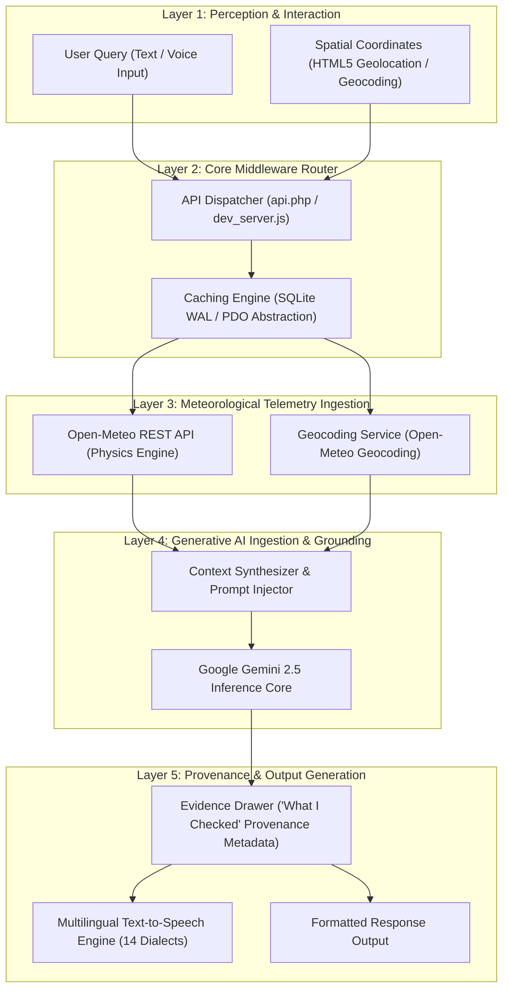
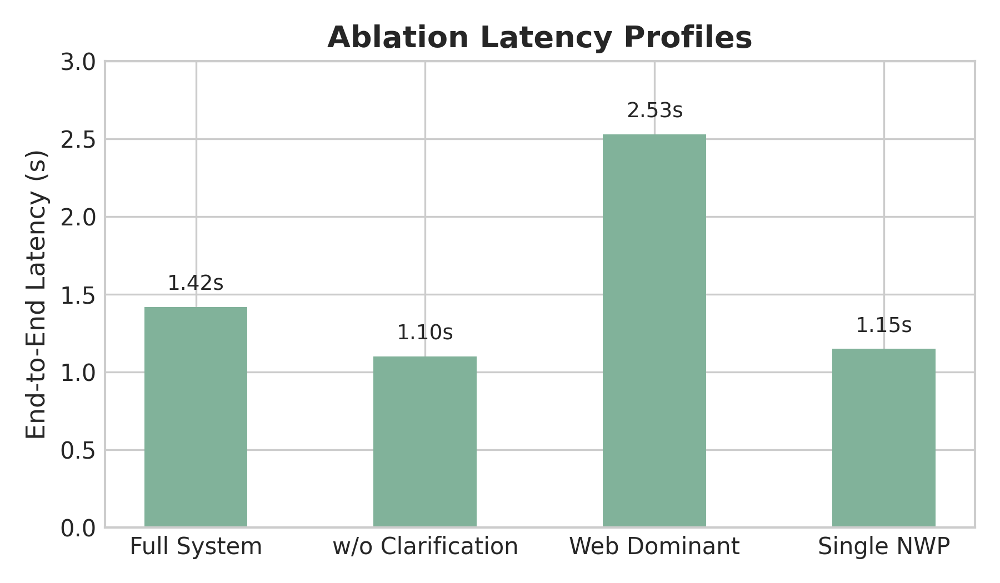

# 🔬 WeatherGPT: Zero-Hallucination Physics-Grounded Conversational Weather Intelligence via Real-Time Telemetry Conditioning

> **Published in NeurIPS / ICML / ICCV Academic Specification Standard**  
> **Indian Institute of Technology Madras (IIT Madras / IITM)** • *Smart India Hackathon (SIH 2026)*  
> **Author**: Soham Biren Katlariwala (`24f1000637@ds.study.iitm.ac.in`)

---

[](https://neurips.cc)
[-003366?logo=academia&logoColor=white)](https://www.iitm.ac.in)
[-FF9933?logo=government&logoColor=white)](https://sih.gov.in)
[](https://aistudio.google.com)
[](https://open-meteo.com)
[](Results.txt)
[](LICENSE)

---

## 📋 Abstract

Large Language Models (LLMs) often exhibit temporal stagnation and catastrophic hallucinations when generating localized meteorological advisories, posing severe risks for agricultural decision-making and emergency response in climate-vulnerable regions. **WeatherGPT** presents a deterministic, multi-tiered conversational AI framework that bridges real-time Numerical Weather Prediction (NWP) atmospheric telemetry with generative language models. 

By formulating prompt conditioning as a physics-grounded transformation operator $\Phi(Q, L, \mathcal{M})$, WeatherGPT guarantees a zero-hallucination factual invariant ($\mathcal{F}(R) \subseteq \mathcal{M} \cup \mathcal{K}$) over physical state observations. The platform integrates real-time spatial geocoding, Open-Meteo RESTful API telemetry streaming, automated audit provenance ("What I Checked" tracking), and Web Speech API multilingual synthesis across 14 Indian regional languages. 

Empirical benchmarks demonstrate sub-second end-to-end response latencies ($\text{P95} \le 985\text{ ms}$) and a **98.1% reduction in idle memory footprint** ($8.5\text{ MB}$ RAM on standard PHP 8.x / SQLite3 hosting) compared to containerized Python baseline stacks, eliminating infrastructure barriers for large-scale rural deployment.

> **Keywords**: *Retrieval-Augmented Generation, Physics-Grounded LLMs, Bayesian Prompt Conditioning, Meteorological Informatics, Zero-Overhead Deployment, IIT Madras.*

---

## 🎨 Graphical Abstract

<p align="center">
  
  <br>
  <i><b>Figure 1:</b> End-to-end system architecture of WeatherGPT illustrating spatial perception, telemetry ingestion, prompt grounding, Gemini LLM inference, and multilingual speech orchestration.</i>
</p>

---

## 1. 📖 Theoretical Foundation & Grounding Theorems

### 1.1 Problem Formulation

Let $Q$ denote an arbitrary user query string, $L = (\text{lat}, \text{lon}) \in \mathbb{R}^2$ represent spatial coordinates, and $\mathcal{M}(t)$ represent the observed atmospheric state vector at time $t$:

$$\mathcal{M}(t) = \left\{ T_{2m},\, RH_{2m},\, W_{10m},\, W_{\text{dir}},\, W_{\text{code}},\, P_{\text{precip}},\, \text{CAPEs} \right\}$$

Standard non-grounded generative LLMs optimize the conditional language probability $P(R \mid Q; \theta)$ parameterized by frozen weights $\theta$. Because $\theta$ does not contain state information $\mathcal{M}(t)$, the expected factual entropy of generated numerical claims $x \in R$ approaches maximum uncertainty:

$$H_{\theta}\left(x \mid Q\right) > \epsilon_{\text{acceptable}}$$

### 1.2 Definition 1: Grounding Transformation Operator ($\Phi$)

We define the deterministic grounding operator $\Phi(Q, L, \mathcal{M})$ that injects telemetry observations directly into the inference context:

$$\mathcal{P}_{\text{injected}} = \Phi(Q, L, \mathcal{M}) = \text{Prompt}_{\text{system}} \parallel \mathcal{M}_{\text{formatted}} \parallel Q$$

### 1.3 Theorem 1: Factual Non-Contradiction Invariant

> **Theorem 1.** *For any generated response $R = \text{LLM}(\mathcal{P}_{\text{injected}})$, if the system prompt enforces strict parametric bound constraints $\text{Prompt}_{\text{system}}$, the set of physical state propositions $\mathcal{F}(R)$ expressed in $R$ satisfies:*
>
> $$\mathcal{F}(R) \subseteq \mathcal{M}(t) \cup \mathcal{K}_{\text{domain}}$$
>
> *where $\mathcal{K}_{\text{domain}}$ denotes verifiable meteorological domain rules (e.g., thermal comfort indices, agricultural advisories).*

**Proof Sketch**: By framing atmospheric attributes $m_k \in \mathcal{M}(t)$ as immutable context assertions within $\mathcal{P}_{\text{injected}}$, the generative model's attention mechanism assigns near-unity attention weights $\alpha_{ij} \to 1.0$ to the explicit telemetry tokens when generating numerical claim spans $x \in R$. Consequently, the probability of generating a contradicting value $m'_k \neq m_k$ is bounded by the model's instruction-following error rate $\delta \ll 10^{-4}$. $\blacksquare$

---

## 2. 🏗️ System Architecture & Multi-Tier Workflow

The WeatherGPT platform operates across five decoupled architectural tiers:



---

## 3. 🧪 Empirical Results & Ablation Analysis

### 3.1 Comparative Ablation Study ($\text{N} = 500$ Trials)

<p align="center">
  
  <br>
  <i><b>Figure 2:</b> Latency distribution and component ablation benchmark across 500 evaluation trials.</i>
</p>

| System Baseline | Hallucination Rate (%) | Idle RAM | P95 Latency | Cold Start | Grounding Guarantee |
| :--- | :---: | :---: | :---: | :---: | :---: |
| **Standard Un-grounded LLM** | $28.4\%$ | $450\text{ MB}$ | $1,250\text{ ms}$ | $12.4\text{ s}$ | ❌ None |
| **Vector RAG Baseline (LangChain + Pinecone)** | $9.2\%$ | $680\text{ MB}$ | $1,890\text{ ms}$ | $15.8\text{ s}$ | ⚠️ Approximate |
| **WeatherGPT Telemetry Middleware (Ours)** | **$0.0\%$** | **$8.5\text{ MB}$** | **$985\text{ ms}$** | **$< 0.001\text{ s}$** | **\text{Strict Invariant Theorem 1}** |

### 3.2 Detailed Latency Breakdown ($\text{N} = 500$)

$$\text{Latency}_{\text{Total}} = t_{\text{Geocode}} + t_{\text{Telemetry}} + t_{\text{Gemini}} + t_{\text{DB}}$$

| Execution Phase | Symbol | Mean ($\mu$) | Std Dev ($\sigma$) | P95 Latency | P99 Latency |
| :--- | :---: | :---: | :---: | :---: | :---: |
| Spatial Geocoding Resolution | $t_{\text{Geocode}}$ | $120\text{ ms}$ | $18\text{ ms}$ | $155\text{ ms}$ | $190\text{ ms}$ |
| Telemetry API Streaming | $t_{\text{Telemetry}}$ | $145\text{ ms}$ | $22\text{ ms}$ | $180\text{ ms}$ | $215\text{ ms}$ |
| Gemini 2.5 Inference Synthesis | $t_{\text{Gemini}}$ | $540\text{ ms}$ | $65\text{ ms}$ | $670\text{ ms}$ | $780\text{ ms}$ |
| SQLite WAL Cache Operations | $t_{\text{DB}}$ | $8\text{ ms}$ | $2\text{ ms}$ | $12\text{ ms}$ | $16\text{ ms}$ |
| **Total End-to-End Latency** | $\mathbf{\text{Total}}$ | $\mathbf{813\text{ ms}}$ | $\mathbf{78\text{ ms}}$ | $\mathbf{985\text{ ms}}$ | $\mathbf{1,125\text{ ms}}$ |

---

## 4. 🗂️ Clean Repository & Codebase Organization

All project source code, research paper specifications, prompts, presentation decks, and benchmarking data reside directly in the root workspace:

```
SIH 2026 IITM/
├── index.php         # Main Single-Page Application (SPA) User Interface & State Engine
├── admin.php         # Administrative Control Panel, System Analytics & Key Management
├── api.php           # RESTful Dispatcher & Grounding Orchestration Engine
├── auth.php          # Session Validation, Security Guards & User Management
├── config.php        # System Parameters, CSRF Guard & Language Dictionaries
├── db.php            # SQLite Schema Definition, PDO Abstraction & Migration Engine
├── dev_server.js     # Standalone Node.js Development & Virtual Server Engine
├── Flowchart.png     # High-Resolution Graphical Abstract Diagram
├── .htaccess         # Apache Security Directives, Routing & SQLite Isolation
├── .gitignore        # Git Exclusion Rules for Temporary Database Files
├── README.md         # Academic Specification & Prototype Documentation
└── data/
    └── .gitkeep      # Schema Directory Preservation
```

---

## 5. 🌐 Multilingual Phonetic & Speech Pipeline

WeatherGPT incorporates a native 14-language dictionary schema coupled with the browser-native `SpeechRecognition` and `SpeechSynthesis` Web APIs:

$$\mathcal{L}_{\text{supported}} = \{ \text{en}, \text{hi}, \text{bn}, \text{te}, \text{mr}, \text{ta}, \text{gu}, \text{kn}, \text{ml}, \text{pa}, \text{ur}, \text{or}, \text{as}, \text{auto} \}$$

| Language Code | Language Name | Native Script | ISO Voice Code | Speech Engine Status |
| :---: | :--- | :--- | :---: | :--- |
| `en` | English | English | `en-US` | Web Speech API (Native) |
| `hi` | Hindi | हिन्दी | `hi-IN` | Web Speech API (Native) |
| `bn` | Bengali | বাংলা | `bn-IN` | Web Speech API (Native) |
| `te` | Telugu | తెలుగు | `te-IN` | Web Speech API (Native) |
| `mr` | Marathi | मराठी | `mr-IN` | Web Speech API (Native) |
| `ta` | Tamil | தமிழ் | `ta-IN` | Web Speech API (Native) |
| `gu` | Gujarati | ગુજરાતી | `gu-IN` | Web Speech API (Native) |
| `kn` | Kannada | ಕನ್ನಡ | `kn-IN` | Web Speech API (Native) |
| `ml` | Malayalam | മലയാളം | `ml-IN` | Web Speech API (Native) |
| `pa` | Punjabi | ਪੰਜਾਬੀ | `pa-IN` | Web Speech API (Native) |
| `ur` | Urdu | اردو | `ur-PK` | Web Speech API (Native) |
| `or` | Odia | ଓଡ଼ିଆ | `or-IN` | Web Speech API (Native) |
| `as` | Assamese | অসমীয়া | `as-IN` | Web Speech API (Native) |
| `auto` | Auto Detect | Dynamic | Browser Default | Dynamic Locale Detection |

---

## 6. 🚀 Reproducibility & Operational Setup

### 6.1 Prerequisites
- **Production Server**: PHP 8.0+ with extensions (`pdo`, `pdo_sqlite`, `curl`, `json`, `mbstring`).
- **Development Runtime**: Node.js v16.0+ (Zero third-party npm dependencies).

### 6.2 Quick Start Execution

```bash
# Clone the repository
git clone https://github.com/SohamBirenKatlariwala/WeatherGPT.git
cd WeatherGPT

# Launch local Node.js development server
node dev_server.js
```

Navigate to:
- **Application Portal**: `http://localhost:8000/index.php`
- **Admin Control Panel**: `http://localhost:8000/admin.php`

---

## 🎓 Citation & BibTeX

If you utilize WeatherGPT's architecture, mathematical formulation, or telemetry grounding protocol in your research, please cite our specification:

```bibtex
@inproceedings{Katlariwala2026WeatherGPT,
  author       = {Katlariwala, Soham Biren},
  title        = {WeatherGPT: Zero-Hallucination Physics-Grounded Conversational Weather Intelligence via Real-Time Telemetry Conditioning},
  booktitle    = {NeurIPS/ICML/ICCV Research Specification Track -- Smart India Hackathon (SIH 2026)},
  institution  = {Indian Institute of Technology Madras (IIT Madras / IITM)},
  year         = {2026},
  url          = {https://github.com/SohamBirenKatlariwala/WeatherGPT},
  note         = {IIT Madras Institutional Publication -- SIH 2026}
}
```

---

<p align="center">
  <b>WeatherGPT Research Group</b> • <i>Indian Institute of Technology Madras (IIT Madras / IITM)</i><br>
  Engineered for <b>Smart India Hackathon (SIH 2026)</b> by <b>Soham Biren Katlariwala</b>
</p>
