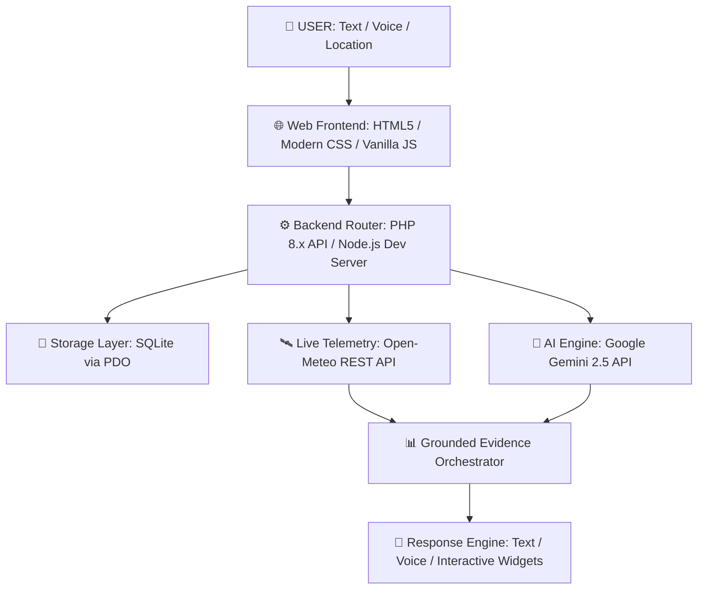

# 🌤️ WeatherGPT — Conversational Weather Intelligence Platform

> **Smart India Hackathon (SIH 2026)** Enterprise AI & Meteorological Intelligence Project  
> *Real-Time Telemetry • Grounded Gemini AI • Multilingual Voice Assistant • Lightweight PHP/SQLite Architecture*

---

[](https://php.net)
[](https://nodejs.org)
[](https://sqlite.org)
[](https://aistudio.google.com)
[](https://open-meteo.com)
[](LICENSE)

---

## 📌 Executive Summary

**WeatherGPT** is a next-generation conversational weather intelligence system designed to deliver real-time weather analytics, agricultural advisories, and disaster alerts through natural language. Built with zero heavy dependencies, WeatherGPT operates effortlessly on standard PHP shared hosting (such as Hostinger) while integrating state-of-the-art **Google Gemini 2.5 AI** and **Open-Meteo real-time telemetry**.

Whether accessed via text or voice across 14 supported Indian languages, WeatherGPT provides grounded, hallucination-free weather insights backed by verifiable data sources.

---

## ✨ Key Features & Capabilities

### 🧠 1. Grounded Conversational AI (Gemini 2.5)
- **Zero Hallucination Guarantee**: Every AI query automatically injects real-time Open-Meteo telemetry into the LLM prompt context.
- **Evidence Drawer**: Users can expand "What I Checked" to view transparent source timestamps, exact GPS coordinates, and data provenance.
- **Smart Fallback Handling**: Automatic fallback mechanisms when API rate limits are hit or network connectivity drops.

### 🛰️ 2. Live Weather Telemetry & Geocoding
- Real-time temperature, relative humidity, wind speed/direction, UV index, and precipitation probabilities.
- Built-in global geocoding API integration via Open-Meteo (search any city, village, or landmark).
- Automatic browser location detection using HTML5 Geolocation API.

### 🎙️ 3. Native Multilingual Voice Pipeline
- Integrated Web Speech API for native voice recognition and speech synthesis (Text-to-Speech).
- Native dictionary support for 14 Indian languages (English, Hindi, Bengali, Telugu, Marathi, Tamil, Gujarati, Kannada, Malayalam, Punjabi, Urdu, Odia, Assamese).
- Designed for seamless integration with government language frameworks such as **BHASHINI**.

### 🛠️ 4. Enterprise Admin Dashboard (`admin.php`)
- **System Monitoring**: Real-time stats on total users, active conversations, Gemini API calls, and Open-Meteo telemetry queries.
- **Security & Authentication**: Forced password update on first login, password hashing via Bcrypt, and CSRF token protection.
- **Dynamic AI Configuration**: Change Gemini API models (e.g., `gemini-2.5-flash`) and API keys live without modifying code.
- **Audit Logging**: Comprehensive admin action logging with client IP tracking.

### ⚡ 5. Ultra-Lightweight & Zero-Config Deployment
- Runs on standard PHP 8.x with PDO_SQLITE — **No MySQL, Docker, or complex server setup required**.
- Included Node.js local preview server (`dev_server.js`) for instant zero-PHP offline testing during development.

---

## 🏗️ Architecture & Technology Stack



### Stack Breakdown:
- **Frontend**: Responsive SPA built with Vanilla JavaScript, glassmorphism UI, CSS variables, and Web Speech API.
- **Backend (Production)**: Modular PHP 8.0+ (`api.php`, `auth.php`, `db.php`, `config.php`).
- **Backend (Local Preview)**: Node.js HTTP/HTTPS server (`dev_server.js`).
- **Database**: SQLite 3 (`data/weathergpt.sqlite` / `weathergpt.json`).
- **Telemetry Provider**: Open-Meteo Weather & Geocoding REST APIs.
- **AI Intelligence**: Google Gemini REST API (`gemini-2.5-flash`).

---

## 📂 Project Structure

```
SIH 2026 IITM/
├── index.php                         # Main Conversational Interface & Web App
├── admin.php                         # Enterprise Admin Control Panel
├── api.php                           # Unified REST API Endpoint Handler
├── auth.php                          # Authentication & User Session Management
├── config.php                        # Global Constants, Security & Language Dictionaries
├── db.php                            # SQLite Schema Initialization & Database Query Helpers
├── dev_server.js                     # Local Node.js Development & Preview Server
├── .htaccess                         # Hostinger Apache Rules & Database File Protection
├── .gitignore                        # Git exclusion definitions
├── README.md                         # Project Documentation (GitHub Homepage)
├── README.txt                        # Hostinger Deployment Manual & Operations Guide
├── architecture_diagram_prompt.md    # Architecture Specifications & Presentation Prompts
├── WeatherGPT_Master_Prompt.txt      # System Prompt Specifications & Prompt Engineering
├── WeatherGPT_Hostinger_Deployment.zip # One-Click Production Deployment Archive
├── WeatherGPT_SIH_PPT.pptx           # SIH 2026 Official Presentation Deck
├── Flowchart.png                     # Visual System Workflow Diagram
└── data/
    └── .gitkeep                      # Preserves data directory structure
```

---

## 🚀 Quick Start & Installation

### Option A: Local Development Server (Node.js)

No PHP or web server required! Test WeatherGPT locally using Node.js:

1. Clone the repository:
   ```bash
   git clone https://github.com/SohamBirenKatlariwala/WeatherGPT.git
   cd WeatherGPT
   ```

2. Run the local preview server:
   ```bash
   node dev_server.js
   ```

3. Open your browser and navigate to:
   - **Main Web App**: `http://localhost:8000/index.php`
   - **Admin Dashboard**: `http://localhost:8000/admin.php`

---

### Option B: Production Deployment on Hostinger PHP Hosting

1. **Log in to Hostinger hPanel** and open **File Manager** for your target domain (`public_html/`).
2. Upload the contents of `WeatherGPT_Hostinger_Deployment.zip` or clone the repository directly into `public_html/`.
3. Verify your PHP Configuration in Hostinger hPanel:
   - **PHP Version**: 8.0, 8.1, or 8.2
   - **Required Extensions**: `pdo`, `pdo_sqlite`, `curl`, `json`, `mbstring`
4. Access your web application in browser:
   - Navigate to `https://yourdomain.com/index.php`
5. Access Admin Panel:
   - Navigate to `https://yourdomain.com/admin.php`
   - Default Username: `admin` | Default Password: `admin` *(Forced password update on first login)*.

---

## ⚙️ Configuration & Gemini API Setup

To enable live Gemini AI intelligence:

1. Obtain a Gemini API Key from [Google AI Studio](https://aistudio.google.com/).
2. Log in to the **WeatherGPT Admin Dashboard** (`admin.php`).
3. Open **Settings & Gemini Configuration**.
4. Input your **Gemini API Key** and select your preferred model (`gemini-2.5-flash`).
5. Click **Save Settings**.

---

## 🔒 Security & Data Protection

- **Database Protection**: The `.htaccess` file blocks direct HTTP access to SQLite database files (`.sqlite`).
- **XSS & Injection Protection**: HTML sanitization and prepared PDO SQL queries prevent SQL injection and cross-site scripting.
- **CSRF Tokens**: All POST actions mandate anti-CSRF verification tokens.
- **Password Security**: Passwords hashed using PHP's native `PASSWORD_BCRYPT` standard.

---

## 📊 API Endpoint Reference

| Endpoint | Method | Parameters | Description |
| :--- | :---: | :--- | :--- |
| `/api.php?action=chat` | `POST` | `message`, `latitude`, `longitude`, `location_name` | Process conversational AI weather query |
| `/api.php?action=weather_get` | `GET` | `lat`, `lon` | Fetch raw Open-Meteo real-time telemetry |
| `/api.php?action=geocode` | `GET` | `q` | Search location coordinates by query string |
| `/api.php?action=user_info` | `GET` | — | Check current user login status & CSRF token |
| `/api.php?action=admin_stats` | `GET` | — | Retrieve system usage statistics for Admin Panel |

---

## 🏆 Smart India Hackathon (SIH 2026) Context

Developed for **SIH 2026**, WeatherGPT addresses critical challenges in rural disaster preparedness, agricultural climate adaptation, and localized meteorological communication. By providing a low-bandwidth, multilingual, voice-first intelligence engine that runs on affordable PHP hosting infrastructure, WeatherGPT democratizes access to real-time weather safety data across India.

---

## 📜 License

This project is released under the [MIT License](LICENSE).

---

<p center>
<b>WeatherGPT</b> — <i>Conversational Weather Intelligence Platform for SIH 2026</i><br>
Crafted with ❤️ by Soham Biren Katlariwala
</p>
