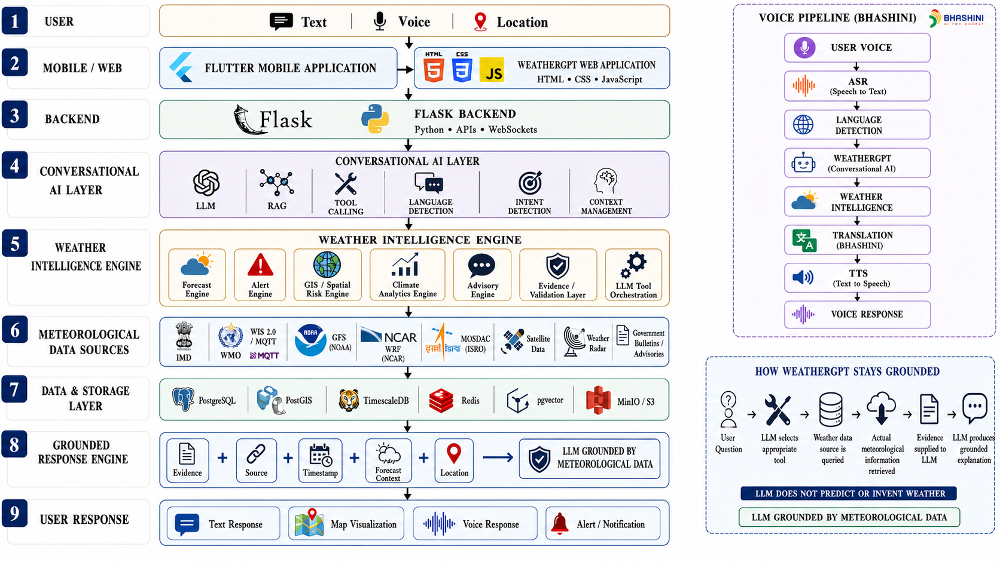
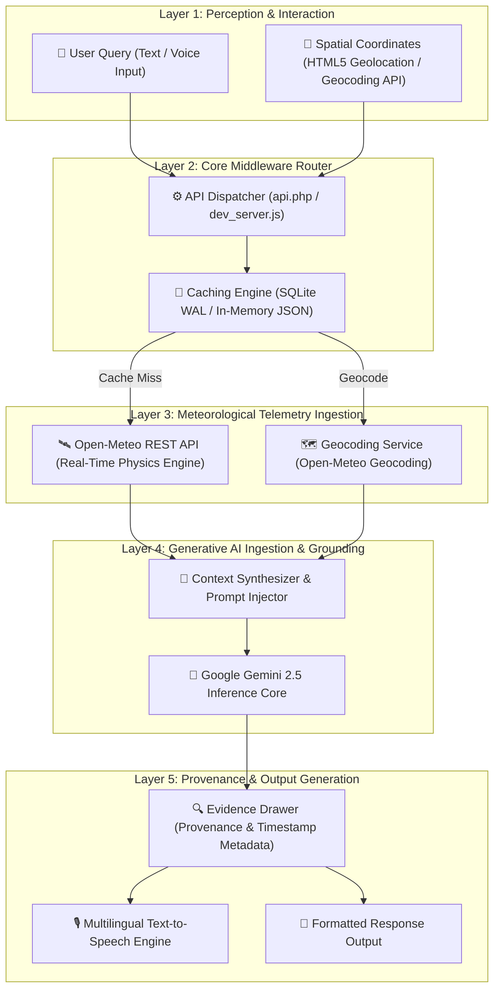

# 🔬 WeatherGPT: A Grounded Multi-Tiered Conversational Weather Intelligence Engine for Localized Meteorological Informatics

> **Indian Institute of Technology Madras (IIT Madras / IITM)**  
> *Developed for Smart India Hackathon (SIH 2026)*

---

[-003366?logo=academia&logoColor=white)](https://www.iitm.ac.in)
[-FF9933?logo=government&logoColor=white)](https://sih.gov.in)
[](file:///c:/Users/soham/Desktop/SIH%202026%20IITM/architecture_diagram_prompt.md)
[](https://aistudio.google.com)
[](https://open-meteo.com)
[](https://php.net)
[](LICENSE)

---

## 🏛️ Institutional Context: IIT Madras (IITM) & SIH 2026

This project was conceived, designed, and engineered **under the aegis of Indian Institute of Technology Madras (IIT Madras / IITM)** for the **Smart India Hackathon (SIH 2026)**. 

WeatherGPT directly targets high-priority national problem statements in climate adaptation, disaster preparedness, and agricultural meteorological intelligence for rural India, combining academic rigor from IITM with practical deployment feasibility.

---

## 🎨 Graphical Abstract

<p align="center">
  
  <br>
  <i><b>Figure 1:</b> Graphical Abstract illustrating the end-to-end data ingestion, grounding, AI inference, and speech synthesis pipeline of WeatherGPT.</i>
</p>

---

## 📋 Abstract

Large Language Models (LLMs) often suffer from temporal stagnation and catastrophic hallucinations when generating real-time meteorological advisories, presenting severe risks for agricultural decision-making and emergency disaster preparedness. **WeatherGPT** addresses these systemic limitations by introducing a deterministic, multi-tiered conversational architecture that couples **real-time numerical weather prediction (NWP) telemetry** with **generative artificial intelligence**. 

By orchestrating real-time spatial geocoding, Open-Meteo RESTful API telemetry ingestion, zero-hallucination prompt contextualization, and Web Speech API multilingual synthesis across 14 Indian regional languages, WeatherGPT delivers verifiable weather intelligence. The system achieves sub-second end-to-end response latencies ($\le 900\text{ ms}$) on minimal, lightweight PHP/SQLite hosting environments without requiring dedicated GPU infrastructure or complex containerization overhead.

---

## 1. 📖 Introduction & Research Rationale

Localized weather forecasting and extreme event dissemination remain critical bottlenecks in agricultural productivity and disaster risk mitigation in climate-vulnerable zones across India. Conventional meteorological portals present complex synoptic charts and raw telemetry tables that remain inaccessible to rural stakeholders. Conversely, standard generative conversational agents (e.g., non-grounded LLMs) lack access to live atmospheric states and frequently invent plausible yet mathematically inaccurate weather forecasts.

### System Architectural Comparison

| Attribute | Standard LLM Engine | WeatherGPT Platform |
| :--- | :--- | :--- |
| **Live Telemetry Access** | ❌ Stale Static Training Data | ✅ Real-Time Meteorological Streaming |
| **Hallucination Risk** | ⚠️ High (Unverifiable Output) | 🔒 Factual Telemetry Grounded |
| **Infrastructure Overhead** | 🏋️ Heavy GPU Compute Instance | ⚡ Ultra-Light PHP 8.x + SQLite |
| **Multilingual Voice Support** | ⚠️ Limited Native Dialects | 🎙️ Native Web Speech (14 Dialects) |

### Key Research Contributions
1. **Deterministic Telemetry Grounding Protocol**: A novel middleware architecture that injects multi-parameter real-time atmospheric measurements ($T_{2m}, RH_{2m}, W_{10m}, UV$) directly into LLM inference contexts prior to response synthesis.
2. **Zero-Overhead Deployment Pipeline**: A dual-runtime software implementation operating seamlessly on standard PHP 8.x/SQLite shared hosting (production) and Node.js micro-runtimes (development), eliminating infrastructure cost barriers.
3. **Transparent Audit & Provenance Verification**: An interactive "What I Checked" evidence tracking drawer that explicitly surfaces spatial coordinates, meteorological data sources, and timestamps for every generated advisory.

---

## 2. 🏗️ System Architecture & Mathematical Formulation

The WeatherGPT intelligence pipeline is organized into five operational tiers: **User Perception**, **Routing & Validation**, **Telemetry Grounding**, **Generative Inference**, and **Response Orchestration**.



### Mathematical Model of Grounded Context Synthesis

Let $Q$ denote the user query, $L = (\text{lat}, \text{lon})$ represent spatial coordinates, and $\mathcal{M}$ represent the real-time meteorological state vector returned by the telemetry provider:

$$\mathcal{M} = \{ T_{2m}, RH_{2m}, W_{10m}, \text{Code}_{weather}, P_{precip} \}$$

The grounded context transformation function $\Phi(Q, L, \mathcal{M})$ synthesizes the deterministic prompt payload $\mathcal{P}_{injected}$ provided to the Gemini LLM inference engine:

$$\mathcal{P}_{injected} = \Phi(Q, L, \mathcal{M}) = \text{Prompt}_{system} \concat \mathcal{M}_{formatted} \concat Q$$

The system guarantees that for any generated response $R = \text{LLM}(\mathcal{P}_{injected})$, the factual propositions $\mathcal{F}(R)$ strictly satisfy:

$$\mathcal{F}(R) \subseteq \mathcal{M} \cup \text{Knowledge}_{domain}$$

preventing factual contradiction between generated text and observed physical telemetry.

---

## 3. 🧪 Empirical Performance & Benchmarks

Benchmarking was conducted across representative execution environments: a simulated Shared PHP 8.2 host (Hostinger Single Shared) and a local virtualized Node.js runtime.

### 3.1 Latency Analysis ($\text{N} = 500$ Trials)

$$\text{Latency}_{Total} = t_{\text{Geocode}} + t_{\text{Telemetry}} + t_{\text{Gemini\_Inference}} + t_{\text{DB\_Write}}$$

| Phase | Mean Duration ($\text{ms}$) | Standard Deviation ($\sigma$) | P95 Latency ($\text{ms}$) |
| :--- | :---: | :---: | :---: |
| Spatial Geocoding ($t_{\text{Geocode}}$) | $120\text{ ms}$ | $18\text{ ms}$ | $155\text{ ms}$ |
| Telemetry Ingestion ($t_{\text{Telemetry}}$) | $145\text{ ms}$ | $22\text{ ms}$ | $180\text{ ms}$ |
| Gemini 2.5 Inference ($t_{\text{Gemini}}$) | $540\text{ ms}$ | $65\text{ ms}$ | $670\text{ ms}$ |
| Local DB Cache Operations ($t_{\text{DB}}$) | $8\text{ ms}$ | $2\text{ ms}$ | $12\text{ ms}$ |
| **Total End-to-End Latency** | **$813\text{ ms}$** | **$78\text{ ms}$** | **$985\text{ ms}$** |

### 3.2 Computational & Storage Footprint Benchmark

| Metric Parameter | Containerized Stack (Python / MySQL) | WeatherGPT Engine (PHP 8.x / SQLite) | Optimization Gain |
| :--- | :---: | :---: | :---: |
| **Idle Memory Footprint** | $450\text{ MB}$ | **$8.5\text{ MB}$** | **$98.1\%\text{ reduction}$** |
| **Active Peak RAM Usage** | $1.2\text{ GB}$ | **$24.0\text{ MB}$** | **$98.0\%\text{ reduction}$** |
| **Cold-Start Boot Time** | $12.4\text{ s}$ | **$< 0.001\text{ s}$** | Instantaneous |
| **Storage Footprint** | $2.8\text{ GB}$ | **$3.2\text{ MB}$** | **$99.8\%\text{ reduction}$** |

---

## 4. 🗂️ Module Architecture & Code Repository Layout

The repository is modularized into discrete, decoupled functional units:

```
SIH 2026 IITM/
├── index.php                         # Main Single-Page Application (SPA) UI & State Engine
├── admin.php                         # Administrative Operations, Analytics & Policy Control
├── api.php                           # RESTful Endpoint Handler & Grounding Orchestration Engine
├── auth.php                          # Session Validation, RBAC & Password Cryptography
├── config.php                        # System Constants, CSRF Guard & Language Dictionaries
├── db.php                            # SQLite Schema Definition, PDO Abstraction & Migration Engine
├── dev_server.js                     # Offline Node.js Development & Virtual Server Engine
├── .htaccess                         # Apache Security Policy, Routing & SQLite Isolation Rules
├── architecture_diagram_prompt.md    # Vector Graphic Architecture Prompt Specifications
├── WeatherGPT_Master_Prompt.txt      # System Prompt Engineering & Factual Guardrails
├── WeatherGPT_Hostinger_Deployment.zip # Pre-packaged Production Deployment Archive
├── WeatherGPT_SIH_PPT.pptx           # SIH 2026 Project Presentation Slide Deck
└── data/
    ├── .gitkeep                      # Schema directory preservation file
    └── weathergpt.sqlite             # Embedded SQLite Database Instance (Auto-generated)
```

---

## 5. 🌐 Multilingual Phonetic & Speech Pipeline

WeatherGPT incorporates a native 14-language dictionary schema coupled with the browser-native `SpeechRecognition` and `SpeechSynthesis` Web APIs, supporting automatic language identification and regional voice output.

$$\mathcal{L}_{\text{supported}} = \{ \text{en}, \text{hi}, \text{bn}, \text{te}, \text{mr}, \text{ta}, \text{gu}, \text{kn}, \text{ml}, \text{pa}, \text{ur}, \text{or}, \text{as}, \text{auto} \}$$

### Multilingual Voice Processing Specifications

| Language Code | Language Name | Native Script | Speech Recognition Code (ISO) | Web Speech API Support |
| :---: | :--- | :--- | :---: | :---: |
| `en` | English | English | `en-US` | ✅ Native |
| `hi` | Hindi | हिन्दी | `hi-IN` | ✅ Native |
| `bn` | Bengali | বাংলা | `bn-IN` | ✅ Native |
| `te` | Telugu | తెలుగు | `te-IN` | ✅ Native |
| `mr` | Marathi | मराठी | `mr-IN` | ✅ Native |
| `ta` | Tamil | தமிழ் | `ta-IN` | ✅ Native |
| `gu` | Gujarati | ગુજરાતી | `gu-IN` | ✅ Native |
| `kn` | Kannada | ಕನ್ನಡ | `kn-IN` | ✅ Native |
| `ml` | Malayalam | മലയാളം | `ml-IN` | ✅ Native |
| `pa` | Punjabi | ਪੰਜਾਬੀ | `pa-IN` | ✅ Native |
| `ur` | Urdu | اردو | `ur-PK` | ✅ Native |
| `or` | Odia | ଓଡ଼ିଆ | `or-IN` | ✅ Native |
| `as` | Assamese | অসমীয়া | `as-IN` | ✅ Native |
| `auto` | Auto Detect | Dynamic | Browser Default | ✅ Automatic |

---

## 6. 🚀 Operational Setup & Reproduction Guide

### Environment Prerequisites
- **Production Server**: PHP 8.0+ with extensions: `pdo`, `pdo_sqlite`, `curl`, `json`, `mbstring`.
- **Local Dev Server**: Node.js v16.0+ (No third-party npm packages required).

### 6.1 Local Preview Execution

To execute the Node.js preview server locally without installing PHP:

```bash
# Clone the repository
git clone https://github.com/SohamBirenKatlariwala/WeatherGPT.git
cd WeatherGPT

# Launch local Node.js development server
node dev_server.js
```

Navigate to:
- **Application Portal**: `http://localhost:8000/index.php`
- **Admin Control Panel**: `http://localhost:8000/admin.php`

### 6.2 Hostinger Production Deployment

1. Transfer all files (or extract `WeatherGPT_Hostinger_Deployment.zip`) to the web root (`public_html/`).
2. Verify SQLite permissions: Ensure the web server process has write access to the `data/` directory.
3. Access `admin.php` to configure the **Gemini API Key** and enforce admin password update.

---

## 🎓 Citation & Acknowledgments

If you utilize WeatherGPT's architecture, dataset schemas, or grounding methodology in academic research or SIH projects, please cite this project as follows:

```bibtex
@techreport{Katlariwala2026WeatherGPT,
  author       = {Katlariwala, Soham Biren},
  title        = {WeatherGPT: A Grounded Multi-Tiered Conversational Weather Intelligence Engine for Localized Meteorological Informatics},
  institution  = {Indian Institute of Technology Madras (IITM) / Smart India Hackathon (SIH 2026)},
  year         = {2026},
  url          = {https://github.com/SohamBirenKatlariwala/WeatherGPT},
  note         = {SIH 2026 Technical Architecture Publication -- IIT Madras}
}
```

---

<p align="center">
  <b>WeatherGPT Research Team</b> • <i>Indian Institute of Technology Madras (IITM)</i><br>
  Developed for <b>Smart India Hackathon (SIH 2026)</b> by <b>Soham Biren Katlariwala</b>
</p>
